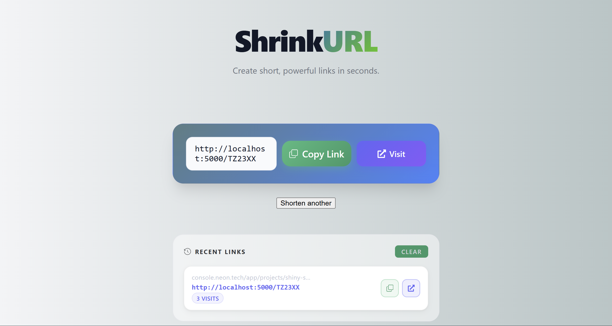

# ShrinkURL

<p align="center">
  <a href="https://shrink-url-ten.vercel.app/" target="_blank">
    
  </a>
</p>

<p align="center">
  
</p>

A full-stack URL shortener built with React, TypeScript, Express, Prisma and PostgreSQL (Neon). Paste a long link, get a short one — with click tracking, visit analytics, persistent history and rate limiting.

## ✨ Features

- 🔗 **URL Shortening:** Generate short codes instantly from any valid URL
- 📊 **Visit Tracking:** Every redirect increments a visit counter, shown live in the history panel
- 🔁 **Duplicate Detection:** Same URL always returns the same short code
- 🛡️ **Rate Limiting:** Prevents abuse with per-IP request limits
- ✅ **URL Validation:** Rejects malformed URLs and non-http/https protocols
- 💾 **Persistent History:** Last 5 shortened links saved across sessions via localStorage
- 📋 **One-click Copy:** Copy short links instantly with visual confirmation
- 🗑️ **Clear History:** Remove all saved links with one click
- 📱 **Responsive Design:** Works on desktop and mobile

## 🚀 Tech Stack

- **Frontend:** React 18, TypeScript, Vite
- **Backend:** Node.js, Express, TypeScript
- **Database:** PostgreSQL via Neon (serverless)
- **ORM:** Prisma with `@prisma/adapter-pg`
- **Rate Limiting:** express-rate-limit

## 📋 Prerequisites

- Node.js (v18 or higher)
- npm
- A Neon account ([neon.tech](https://neon.tech))

## 🛠️ Installation

1. **Clone the repository**
```bash
git clone https://github.com/yourusername/shrinkurl.git
cd shrinkurl
```

2. **Install backend dependencies**
```bash
cd backend
npm install
```

3. **Install frontend dependencies**
```bash
cd ../frontend
npm install
```

4. **Set up environment variables**

Create a `.env` file inside the `backend/` folder:
```env
DATABASE_URL=your_neon_postgres_connection_string
```

5. **Set up the database**

```bash
cd backend
npx prisma migrate dev --name init
```

The `url` table requires:

| Column | Type | Notes |
|--------|------|-------|
| id | String | Auto-generated CUID |
| originalUrl | String | The full URL |
| shortCode | String | Unique short identifier |
| clicks | Int | Defaults to 0 |
| createdAt | DateTime | Auto-set on creation |

6. **Start the backend**
```bash
cd backend
npm run dev
```
Runs on `http://localhost:3000`

7. **Start the frontend**
```bash
cd frontend
npm run dev
```
Runs on `http://localhost:5173`

## 📖 Usage

1. Paste any URL into the input field (with or without `https://`)
2. Click **Shorten** to generate a short link
3. Copy the short link or click **Visit** to open it
4. Your last 5 links appear in the **Recent Links** panel with live visit counts
5. Click **Clear** to wipe your history

## 🏗️ Project Structure

```
SHRINKURL/
├── backend/
│   ├── prisma/
│   │   └── schema.prisma          # Database schema
│   ├── src/
│   │   ├── controllers/
│   │   │   └── controller.ts      # Request handlers
│   │   ├── lib/
│   │   │   └── prisma.ts          # Prisma client setup
│   │   ├── models/
│   │   │   └── model.ts           # TypeScript interfaces
│   │   ├── routes/
│   │   │   └── routes.ts          # Express route definitions
│   │   ├── services/
│   │   │   └── service.ts         # Business logic + Prisma calls
│   │   ├── utils/
│   │   │   └── generateShortCode.ts
│   │   └── index.ts               # Express app entry point
├── frontend/
│   └── src/
│       ├── components/
│       │   ├── styling/
│       │   │   └── UrlForm.css
│       │   ├── HistoryList.tsx    # Recent links section
│       │   ├── ResultCard.tsx     # Short link result display
│       │   ├── UrlForm.tsx        # Input form + validation
│       │   └── UrlShortener.tsx   # Parent, manages shared state
│       ├── App.css                # Global styles
│       ├── App.tsx
│       ├── config.ts              # API base URL config
│       └── main.tsx
├── screenshots/
│   └── preview.png
└── README.md
```

## 🔑 Environment Variables

| Variable | Description |
|----------|-------------|
| `DATABASE_URL` | Your Neon PostgreSQL connection string |

## 🛡️ Rate Limiting

The `/shorten` endpoint is rate limited to **20 requests per 10 minutes** per IP address. Redirect links (`/:shortCode`) are not rate limited.
